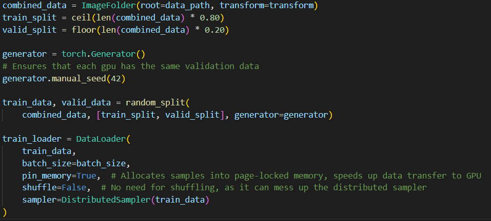

> # __Distributed Machine Learning in PyTorch__  
__This project is intended to explore PyTorch's Distributed ML training capabilities, specifically, the Distributed Data Parallel strategy (DDP).__

> ## __Important files__
file/dir | description
--- | --- 
model_tester.ipynb | used for testing trained models
dataloader_visualization.ipynb | visualizing data
ddp_trainer.py | trainer class definition for DDP training
multi_node_trainer.py | driver code for single and multinode training
scripts/ | used to easily execute training code on EC2 VMs with pytorch's torchrun

> ## __One Worker Script__
`bash scripts/one_node_train.sh TRAIN_TIME  SAVE_NAME  BATCH_SIZE`

__Example__:

`bash scripts/one_node_train.sh 3.0 single_node 64`

> ## __Multi Worker Script__
`bash scripts/one_node_train.sh TRAIN_TIME WORKER_NUM WORLD_SIZE SAVE_NAME BATCH_SIZE`

__Example__: (executed on each participating node)

`bash scripts/multi_node_train.sh 3.0 0 4 multi_node 64`  
`bash scripts/multi_node_train.sh 3.0 1 4 multi_node 64`  
`bash scripts/multi_node_train.sh 3.0 2 4 multi_node 64`  
`bash scripts/multi_node_train.sh 3.0 3 4 multi_node 64`  

__See useful_server_commands.txt for more examples. Note, need to configure master server IP in scripts/multi_node_train.sh__

>__Args:__
***

`TRAIN_TIME = Total training time in hours`  
`WORKER_NUM = worker number`  
`WORLD_SIZE = Total worker count`    
`SAVE_NAME = Save name for saving snapshots (For fault tolerance) and training metrics`  
`BATCH_SIZE = Batch size per device `

> # __DDP-Enabling Code in PyTorch__
> ### __DDP Setup__
__Important Import:__  
`from torch.distributed import init_process_group, destroy_process_group`

__Description:__  

__Code Snippet:__  
from `multi_node_trainer.py`

> ### __Dataloader Distributed Sampler__

__Important DDP Import: __ 
`from torch.utils.data.distributed import DistributedSampler`

Dataloader sampler must be wrapped with `DistributedSampler`.  
 Imports: `from torch.utils.data.distributed import DistributedSampler`  
 If `random_split()` is used, a manual seed must also be used to ensure that each worker (GPU) gets the same split of training data and validation data.

Code Snippet from `multi_node_trainer.py`

> # __AWS Details__
***

For PyTorch DDP testing I trained the same model with the same data on 1, 2, 4, and 8 AWS EC2 instances.

Instance Type | __g4dn.2xlarge - 8 vCPUs - 1 Nvidia T4 GPU__
---|---
__Network Speed__ | __25 GB/s__

In each experiment, I trained for 2 hours.

> # __Model & Data__
***

> # __Results with Pytorch's DDP Strategy__
***

|                           | 1 Node  | 2 Nodes | 4 Nodes | 8 Nodes |
|      ---                  |     --- | ---     | ---     |   ---   |
| __Learning Rate (e-4)__   | 1.00    | 1.41    | 2.00 | 2.83 |
| __Global Batch Size__     | 32      |  64     | 128 | 256 |
| __Steps Per Epoch__       | 650     | 375     | 163 | 82 |
| __Avg Epoch Time(min)__   | xxx     |         |
| __Epoch Num @ 2 hr__      | xxx     |         |
| __Images Per Sec__        | xxx     |       |
| __Scaling Efficiency__    | xxx     |       |
| __Best Validation Loss__  | xxx     |       |
| __Test Loss__             | xxx     |  0.435    | 0.429 
| __Top1 Test Accuracy__    | 86.90%  | 87.30%    | 87.50% | 87.50%

***

># __Summary Graphs__

># __Conclusions on Distributed Training with Pytorch's DDP Strategy__

__Scale up before scaling out!__ 

Depending on network speeds, it is very likely that the communication overhead caused by gradient synchronization between nodes will decrease scaling efficiency as the number of workers increases. I recommend connections that exceed 100GB/s, but even those kinds of speeds do no compare to linked GPU transfer speeds. Because of this, I recommend to perform training on multi GPU systems. It's clear that 1 system with 8 GPUs is better than 8 systems with 1 GPU (not certain, but I think this is likely to be hte case). If scaling beyond just 1 system with 8 GPUs, then one can add additional nodes. This may seem obvious, but it wasn't so obvious to me until this experiment (mostly because 8 nodes are likely to have 8x the number of cpu cores, and it's hard to know just how much those CPU extra CPU cores factor in). More testing will be conducted in the future.